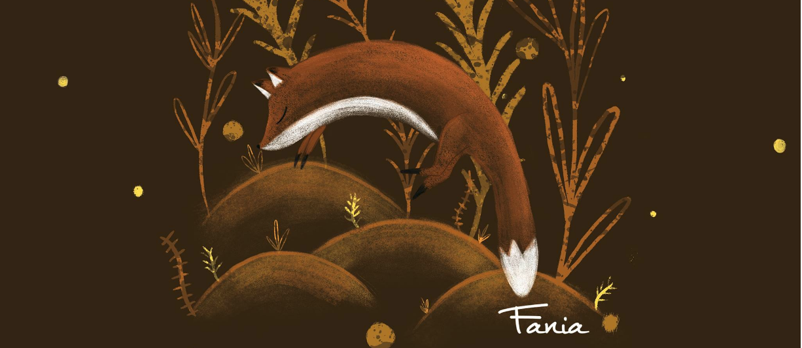
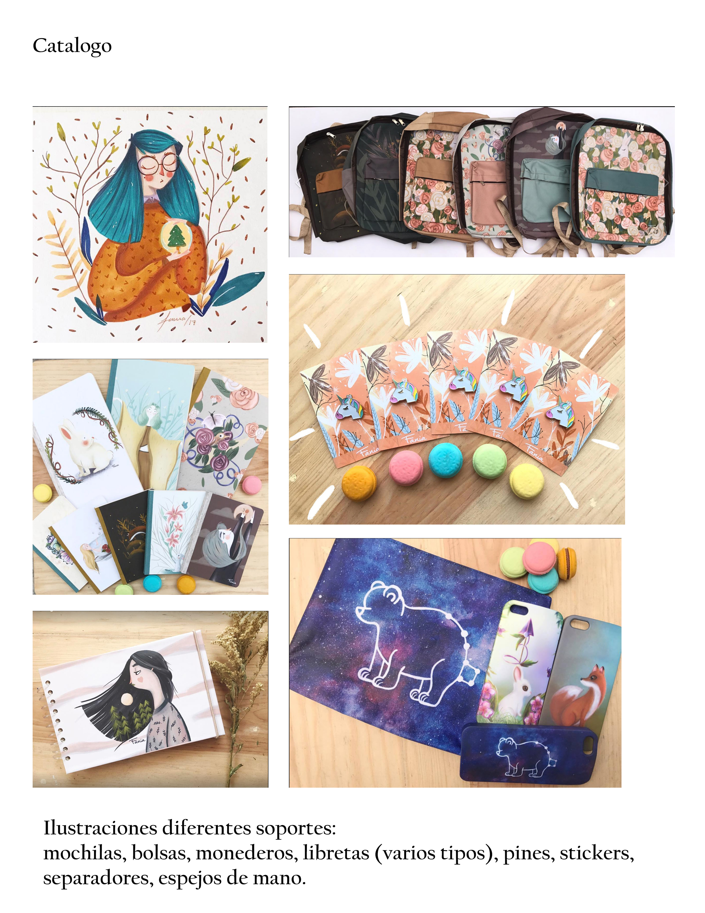
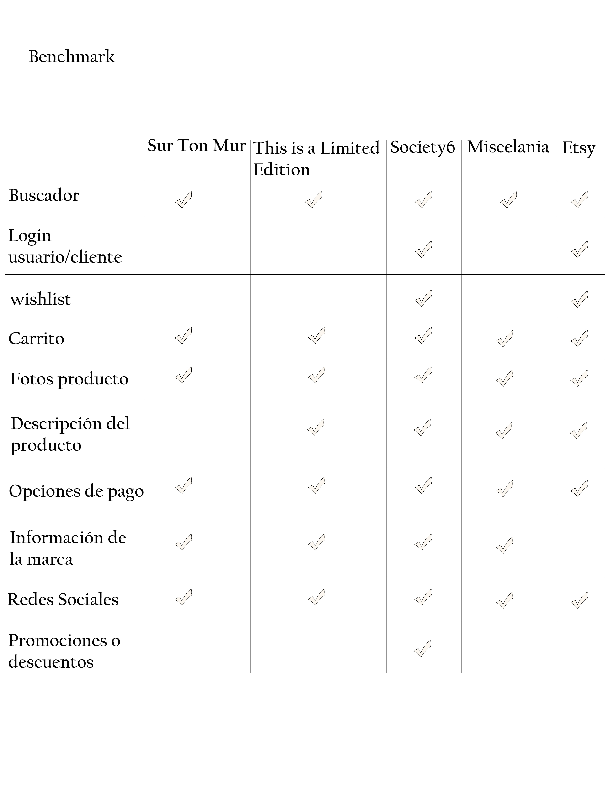
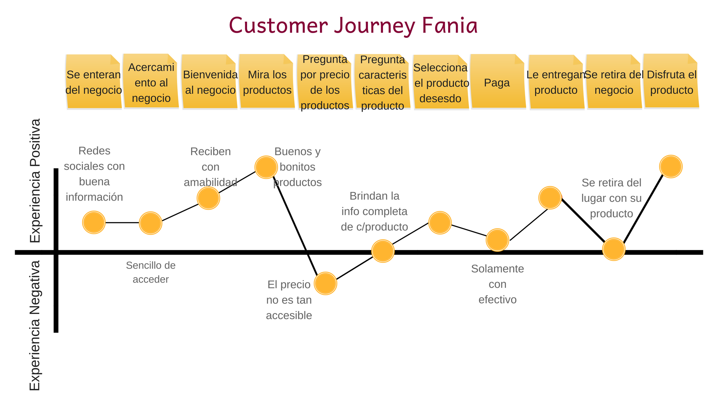
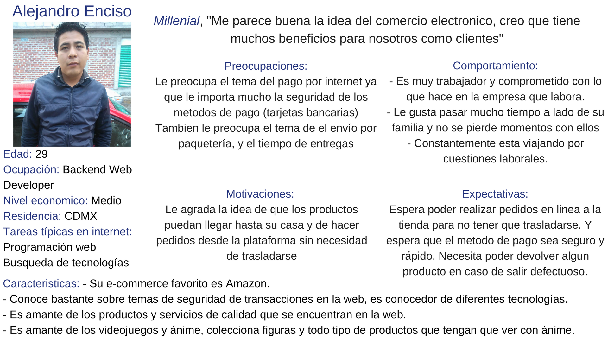

# E - C O M M E R C E
 Negocio a enfocar
====================
## Introducción

Fania es una micro empresa que dio inicio en enero del 2016, en un principio como un proyecto personal por parte de Yaritza, ella como ilustradora quería promover todo su material visual (ilustraciones) posteriormente lo plasmo en diferentes soportes (mochilas, bolsas, libretas, etc) creciendo este gran proyecto empezó a ganar atención.

Sus temáticas están relacionadas con la naturaleza y animales, hace uso de colores claros y neutros.

Los bazares de diseño fueron una gran impulso, posteriormente las redes sociales, con las cuales se dio a conocer de mayor manera, ya que tambien le ayudaron como intermediario en ventas.

## Catalogo

Pain Points
====================
Uno de los principales recursos que utiliza la marca Fania para vender los productos y darlos a conocer es a través de los diferentes bazares de diseño que se llegan a organizar dentro de La Ciudad de México, se debe mencionar que el asistir a uno de estos eventos implica gastos como el pagar un lugar lo cual muchas veces no es rentable, pero tras el último temblor sucedido el año pasado las zonas donde se daba lugar los bazares de diseño quedaron afectadas provocando que estos quedaran suspendidos por un tiempo.

Posteriormente la marca Fania hizo uso de diferentes redes sociales como “Facebook” y “Twitter” para difundir todo sus productos con una cantidad considerable de seguidores, Facebook 4755 seguidores y Twitter, sirviendo como intermediario estas redes para poder vender algunos productos, pero muchas veces resulta complicado ya que el proceso es hacer las entregas en alguna estación del metro, también a la par este tipo de entregas de producto causa desconfianza tanto para el cliente como usuario.

-	Sin bazares de diseño a los cuales acudir, se limitaba a la marca Fania a ofrecer sus productos ya que no cuenta con un lugar fijo donde poder venderlos.
-	En ocasiones resultaba poco rentable el asistir a los bazares de diseño ya que no se obtenían suficientes ganancias
-	El hacer uso de las redes sociales como un intermediario para entregar los productos resulta complicado en ocasiones en cuestión de logística, y más aparte los productos no pueden mostrarse en fotografías de alta calidad.

Objetivos
====================
A través de la implementación de una e-commerce a esta microempresa se fortalecerá de la siguiente manera:
- Obtener los productos de la marca si necesidad de asistir a un lugar en específico.
- Dar difusión a la marca sin depender solo de los eventos de bazares.
- Tener acceso a los productos en cualquier momento.
- Brindar mayor confianza tanto cliente – usuario al momento de ejecutar un pedido – venta.
- Evitar intermediarios durante una venta

Benchmark
====================
Tras una investigación de e-commerce se descubrió que para el nicho de micro empresas relacionadas a la de nuestro cliente la mayoría prefiere hacer uso de plataformas donde brinda herramientas que hacen más fácil al cliente subir sus productos, evitando la tarea de hacer todo una planeación de su propia e-commerce, estas funcionan como una gran comunidad donde puedes tanto ofrecer tus productos como el comprar, se considera que esto le resta personalidad a tu marca ya que debes competir a la par con otras personas que posiblemente ofrezcan el mismo producto que tú, pero funcionan como referencia para tomar en cuenta los elementos a considerar en nuestra e-commerce. 

Entrevista
====================
https://drive.google.com/open?id=1Y8ab1exp8_kVvpJo2t1xAmesGHM-j4X

CUSTOMER JOURNEY MAP

USER PERSONA

